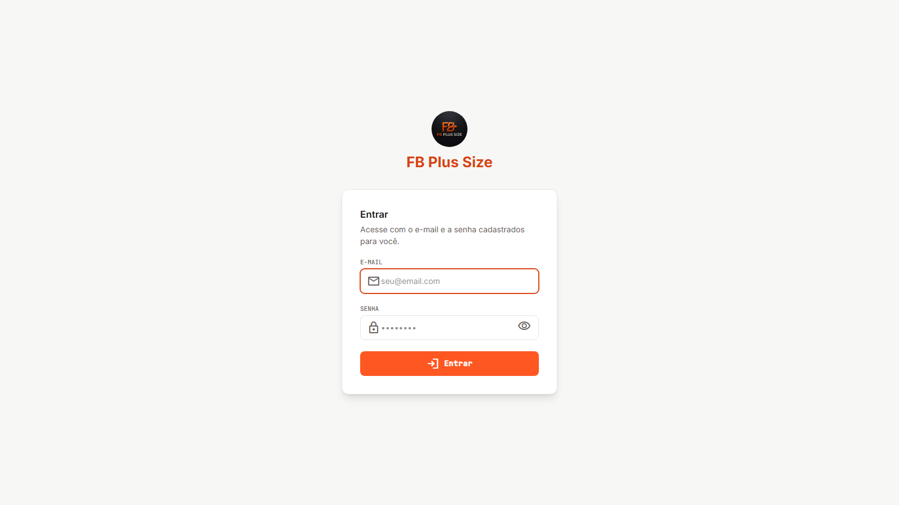
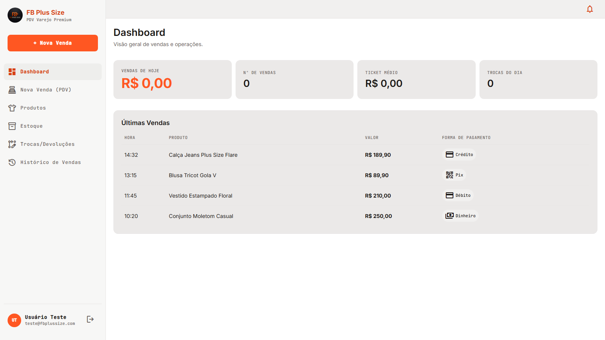
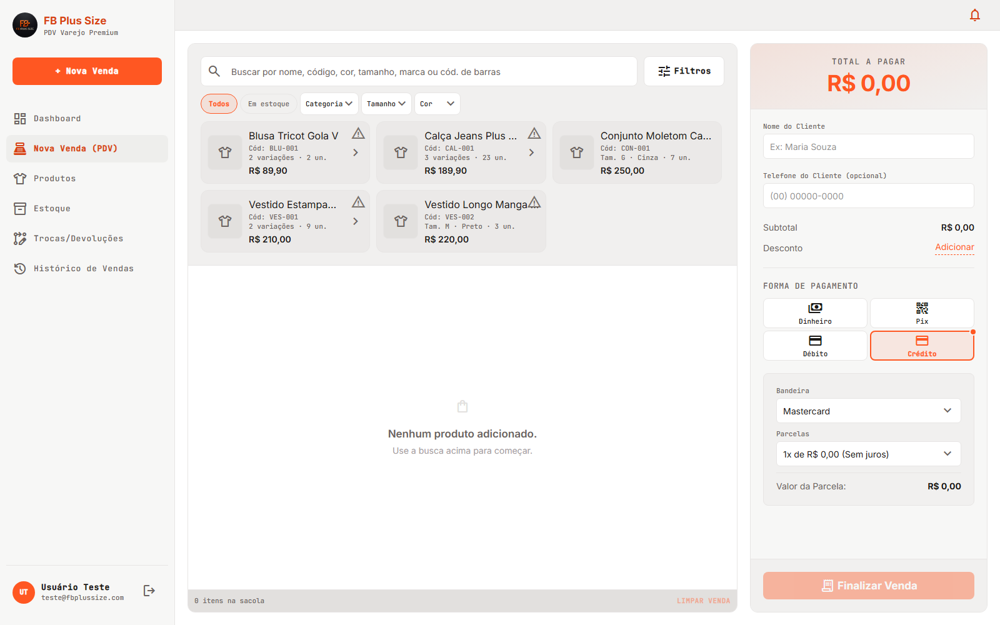
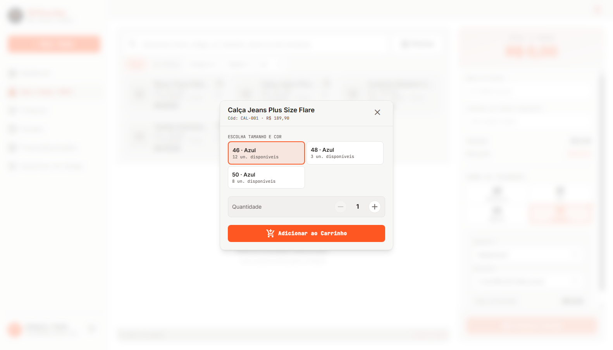
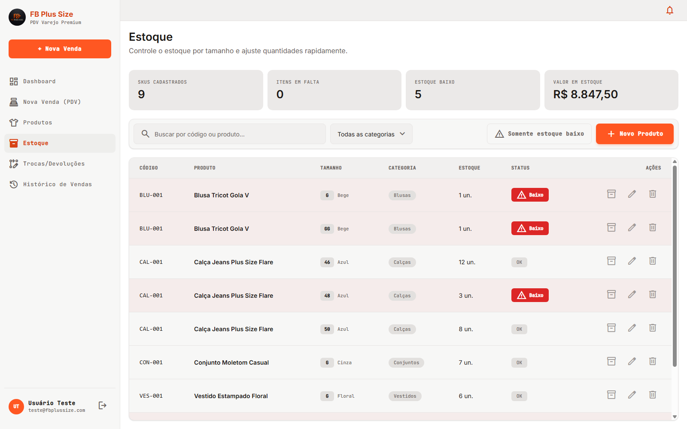
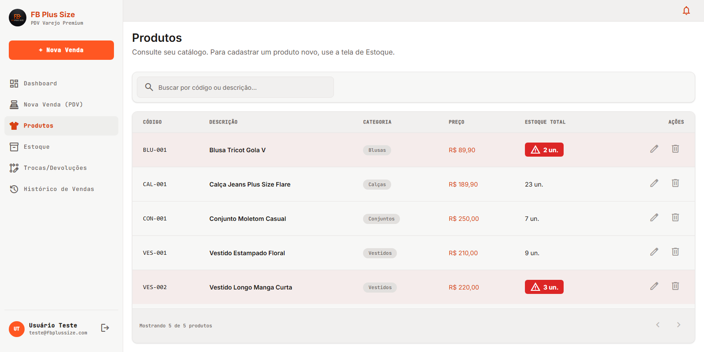
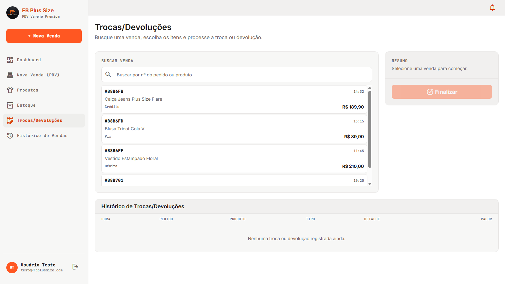
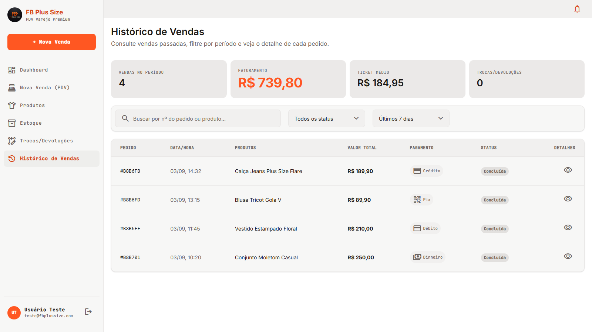

# FB Plus Size

Sistema de ponto de venda e gestão de estoque para loja de roupas plus size — do login ao fechamento do caixa.

> As telas abaixo mostram dados de demonstração, usados apenas para ilustrar o funcionamento.

## Funcionalidades

### Login

Acesso individual e protegido por sessão. Não existe tela de cadastro aberto — cada login é criado manualmente para as pessoas autorizadas.



### Dashboard

Resumo do dia assim que o sistema abre: vendas de hoje, número de vendas, ticket médio e as últimas movimentações.



### Nova Venda (PDV)

Busca por nome, código, cor, tamanho, marca ou código de barras, com filtros rápidos (categoria, tamanho, cor, disponibilidade em estoque) e um painel de filtros avançados (faixa de preço, marca, ordenação).



Quando um produto tem mais de uma combinação de tamanho e cor, a seleção mostra só o que realmente tem estoque disponível — e nunca deixa vender mais unidades do que existe.



### Estoque

Cadastro de produtos novos (nome, categoria, preço, tamanhos, cores e quantidades), ajuste de estoque, edição de tamanho/cor das variações existentes, e alerta automático de estoque baixo.



### Produtos

Catálogo centralizado — espelha automaticamente tudo o que é cadastrado em Estoque, sem retrabalho.



### Trocas e Devoluções

Busca a venda, escolhe o item, processa a troca ou devolução — o estoque das peças envolvidas se ajusta sozinho.



### Histórico de Vendas

Todas as vendas registradas, com forma de pagamento, status e filtro por período.

O histórico consulta todas as páginas da API. O valor de cada pedido inclui o desconto; o faturamento considera o saldo após trocas e devoluções. Devoluções parciais mantêm no faturamento o valor dos itens que ficaram com o cliente. Esses indicadores agrupam o saldo pela data da venda original, não representam um fluxo de caixa por data de reembolso.



## Stack

**Backend** (`be/`) — Node.js, Express 5, Prisma + MongoDB, Zod, JWT em cookie httpOnly, bcryptjs.

**Frontend** (`fe/`) — React 19, React Router, Vite, TypeScript, Tailwind CSS 4.

## Rodando localmente

### Backend

```bash
cd be
npm install
cp .env.example .env   # preencha DATABASE_URL, JWT_SECRET e CORS_ORIGIN
npm run prisma:push
npm run dev
```

Crie um login de acesso:

```bash
npm run create-user -- "Nome Completo" email@exemplo.com senha123
```

### Frontend

```bash
cd fe
npm install
cp .env.example .env   # aponte VITE_API_URL para o backend
npm run dev
```

## Deploy

Backend e frontend rodam como serviços separados no Railway. O frontend usa `serve -s dist` para servir o build estático com suporte a rotas do React Router; o backend precisa das variáveis `DATABASE_URL`, `JWT_SECRET` e `CORS_ORIGIN` (com a URL do frontend em produção) configuradas no serviço.

Após atualizar o backend, execute `npm run prisma:generate` e `npm run prisma:push` no ambiente configurado. O campo interno `Sale.exchangeVersion` permite detectar devoluções concorrentes da mesma venda; documentos antigos recebem o valor padrão na leitura e são atualizados na próxima troca/devolução. O MongoDB precisa suportar transações (replica set, como no Atlas).

## Validação

No backend, `npm test` executa testes de regressão das rotas HTTP e dos cálculos do frontend, substituindo apenas o acesso ao banco por dados isolados. Não acessa o banco da loja. Execute também `npm run build` em `be/` e `npm run build` e `npm run lint` em `fe/`.
